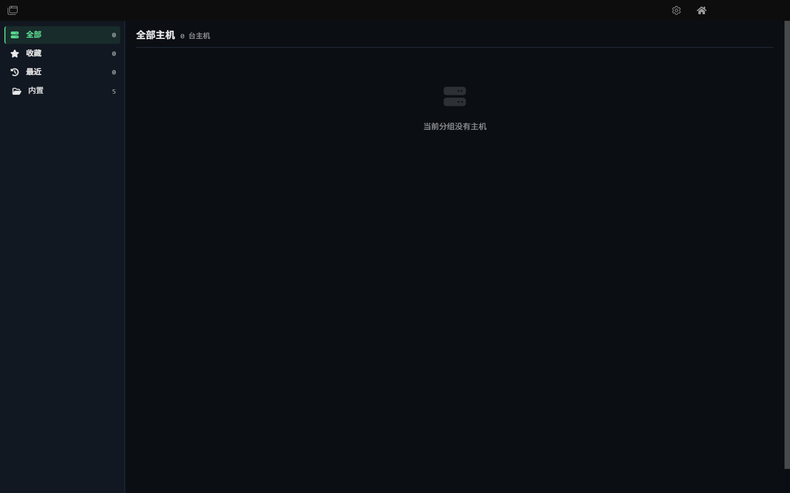

---

issh is a customized fork of [Tabby](https://tabby.sh) (formerly **Terminus**), focused on SSH and terminal workflows for Windows.

Based on Tabby v1.0.7, with UI enhancements and bug fixes for daily SSH management.

## Downloads

Pre-built Windows artifacts (located in `dist/` after building):

- `issh-0.1.0-setup-x64.exe` — NSIS installer
- `issh-0.1.0-portable-x64.zip` — portable archive

## Features

### Terminal

- VT220 terminal with multiple nested split panes
- Tabs on any side of the window
- Optional dockable window with global hotkey ("Quake console")
- Progress detection and process completion notifications
- Bracketed paste, multiline paste warnings
- Font ligatures and custom shell profiles
- Full Unicode support including double-width characters
- PowerShell (and PS Core), WSL, Git-Bash, Cygwin, MSYS2, Cmder and CMD support
- Terminal toolbar with quick actions

### SSH Client

- SSH2 client with connection manager
- X11 and port forwarding (local, remote, dynamic/SOCKS)
- Jump host / bastion support
- Agent forwarding (incl. Pageant and Windows native OpenSSH Agent)
- Login scripts
- SFTP file transfer via Zmodem
- RSA-SHA2 / ECDSA key authentication with passphrase support
- HTTP / SOCKS proxy support
- Batch input — send commands to multiple SSH sessions simultaneously
- Enhanced SFTP panel with improved file management UI

### Start Page & Host Manager

- Redesigned start page with quick-connect shortcuts
- Enhanced host management interface with card-based layout
- Improved profile settings tab with streamlined configuration flow

### AI Assistant (issh-llm)

LLM-powered command autocomplete, next-command prediction, and local CLI/MCP agent bridge, built directly into the terminal.

#### Features

- **Smart Autocomplete**: As you type, suggests commands from local history, login scripts, cached AI predictions, and live AI completions. Local matches appear immediately; live AI is debounced and silently falls back on timeout.
- **Next-command Prediction**: After you submit a command, the assistant prefetches likely follow-up commands using the previous command and terminal context, then ranks them together with history as you start typing.
- **Dangerous Command Guard**: Automatically detects potentially destructive commands (`rm -rf`, `dd`, `mkfs`, `chmod 777`, `curl | sh`, etc.) and shows a warning dialog before execution.
- **Sensitive Data Redaction**: API keys, tokens, passwords, and private keys in terminal output are redacted locally before being sent to the LLM.
- **Command History**: Loads local shell history and SSH history, keeps recent in-tab commands, and limits history candidates so the autocomplete panel stays readable.
- **Suggestion Cache**: Autocomplete results cached for 5 minutes to reduce API calls.
- **CLI / MCP Agent Bridge**: Optional localhost bridge for Codex, Cursor, Claude Desktop, and other agents, protected by token scopes and audit logs.

#### Configuration

Open **Settings → AI assistant** to configure:

| Setting | Default | Description |
|---|---|---|
| Enable AI features | Off | Master toggle for all AI functionality |
| API base URL | `https://api.openai.com/v1` | Any OpenAI-compatible endpoint |
| API key | — | Stored locally in `config.yaml` |
| Model | `gpt-4o-mini` | Model name for chat completions |
| Autocomplete model | empty | Optional fast model for autocomplete; falls back to Model |
| Disable thinking for autocomplete | On | Sends provider-specific low/no-reasoning hints when supported |
| Autocomplete timeout (ms) | `1000` | Live AI timeout; local history/cache remain available |
| Autocomplete debounce (ms) | `600` | Delay before triggering live AI autocomplete while typing |
| History candidate limit | `10` | Maximum history suggestions shown before AI/script candidates |
| Editor autocomplete | Off | Opt-in AI text completion inside vim/nano alternate screen |
| Autocomplete while typing | On | Auto-trigger suggestions as you type |
| Send terminal context to API | On | Send recent terminal output for better context (sensitive patterns redacted) |
| Max context lines | `20` | Number of recent terminal lines included in AI requests |
| Execute on confirm | Off | Auto-run accepted autocomplete suggestions without pressing Enter |
| Panel offset X / Y | `32` / `52` | Moves the autocomplete panel away from the cursor |

Click **Test connection** after entering your API key to verify connectivity.

#### Compatible API Providers

Any provider that implements the OpenAI Chat Completions API (`/chat/completions`):

- **OpenAI** — `https://api.openai.com/v1`
- **Azure OpenAI** — `https://<resource>.openai.azure.com/openai/deployments/<deployment>/v1`
- **Ollama** — `http://localhost:11434/v1`
- **LM Studio** — `http://localhost:1234/v1`
- **DeepSeek** — `https://api.deepseek.com/v1`
- **Moonshot (Kimi)** — `https://api.moonshot.cn/v1`

#### Hotkeys

| Hotkey | Action |
|---|---|
| `Ctrl+Shift+Space` | Trigger autocomplete manually |
| `Ctrl+Y` | Accept selected suggestion |
| `Ctrl+N` | Next suggestion |
| `Ctrl+U` | Previous suggestion |
| `Esc` | Dismiss autocomplete panel |

All hotkeys are customizable in **Settings → Hotkeys**.

#### How It Works

1. **Autocomplete**: The plugin reads the current partial command from the xterm.js buffer, collects terminal context (OS, shell, working directory, recent output), and merges history, login-script, cached prediction, and live AI candidates with deduplication and ranking.
2. **Next-command prediction**: The first command in a shell session does not trigger live AI autocomplete. Once a command is submitted, AI prefetches likely follow-up commands from the previous command and current context, then reuses that cache while you type.
3. **Privacy**: When "Send terminal context to API" is enabled, recent terminal output is included to improve suggestion quality. Sensitive patterns (API keys, tokens, passwords, private keys) are redacted locally before sending. Disable this option to send only command fragments without recent output.
4. **Agent Bridge**: The optional CLI/MCP bridge exposes local issh sessions to external agents over localhost using token scopes, SFTP limits, dangerous-command confirmation, and audit logging.

### Security Hardening and Chromium Risk

As of 2026-08-02, the current release uses Electron `43.2.0` with Chromium `150.0.7871.129`. No stable Electron release currently ships Chromium `150.0.7871.219`, so this fork uses compensating controls; these controls do not claim to remove Chromium CVEs.

- The main window has a local-page CSP that permits packaged resources plus HTTPS/WSS and loopback connections, while denying object loading and framing.
- Privileged configuration, plugin, PTY, window-control, and new-window IPC accepts only senders from the app-owned local renderer.
- Windows packaging enables ASAR integrity validation and `onlyLoadAppFromAsar`; the `runAsNode`, `NODE_OPTIONS`, and CLI-inspect Fuses remain disabled.
- GPU acceleration remains an operational toggle at **Settings → Window → Hacks → Disable GPU acceleration** rather than a forced default, avoiding an unnecessary performance trade-off.
- Load only trusted local plugins and never load remote pages in the privileged Electron window. Do not use an Electron alpha/nightly build as the production upgrade path.

The current architecture still uses `nodeIntegration: true` and `contextIsolation: false`. A full sandbox/contextBridge migration is follow-up architecture work, not a small Chromium hotfix. Monitor the [Electron security guidance](https://www.electronjs.org/docs/latest/tutorial/security) and [stable release list](https://releases.electronjs.org/release/); once an official stable release carries the relevant fixes, upgrade it and run the full build, regression, and packaging gates.

See [Chromium compensating-hardening record](./SECURITY_REMEDIATION_2026-08-02.md) for the implementation scope and verification record.

## Portable

issh will run as a portable app on Windows if you create a `data` folder in the same location where `issh.exe` lives.

## Building from Source

### Prerequisites

- Node.js 18+
- Yarn 1.x
- Python 3 (for native module builds)
- Visual Studio Build Tools (for native module compilation)

### Build Steps

```bash
# Install dependencies
yarn

# Smoke test: TypeScript type-checks
npx tsc -p issh-core/tsconfig.json --noEmit
npx tsc -p issh-settings/tsconfig.json --noEmit
npx tsc -p issh-terminal/tsconfig.json --noEmit
npx tsc -p issh-ssh/tsconfig.json --noEmit
npx tsc -p issh-local/tsconfig.json --noEmit
npx tsc -p issh-electron/tsconfig.json --noEmit
npx tsc -p issh-linkifier/tsconfig.json --noEmit
npx tsc -p issh-auto-sudo-password/tsconfig.json --noEmit
npx tsc -p issh-community-color-schemes/tsconfig.json --noEmit

# Smoke test: Webpack build
yarn run build

# Build Windows installer
node scripts/build-windows.mjs
```

If `prepackage-plugins.mjs` fails due to native module rebuild issues, use the skip flag:

```bash
set ISSH_SKIP_PREPACKAGE=1&&node scripts/build-windows.mjs
```

## Changes from Upstream Tabby

- **Batch input**: Send commands to multiple SSH sessions at once
- **Enhanced SFTP panel**: Improved file management UI with better visual feedback
- **Terminal toolbar**: Quick-action toolbar for common terminal operations
- **Redesigned start page**: Quick-connect shortcuts with improved layout
- **Enhanced host manager**: Card-based host management with streamlined profile configuration
- **Private key fix**: Resolved RSA-SHA2 private key authentication failures
- **AI Assistant (issh-llm)**: LLM-powered command autocomplete, next-command prediction, CLI/MCP Agent Bridge, dangerous command detection, and sensitive data redaction

## Acknowledgements

Based on [Tabby](https://github.com/Eugeny/tabby) by Eugeny. Thanks to all upstream contributors.

---

This README is also available in: [简体中文](./README.zh-CN.md)
