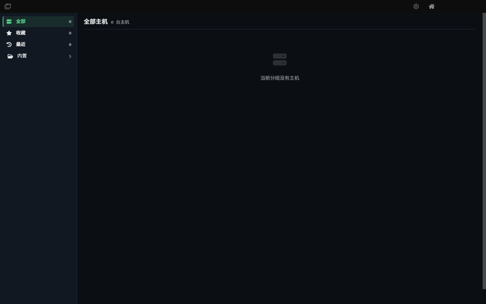

# issh — Lightweight, Secure, AI-Native SSH Terminal

**issh 0.1.3** is an SSH terminal built on **Tauri 2 + Rust**. It combines a terminal, SSH and SFTP tools, a locally encrypted credential vault, and agent workflows in a compact Windows installer.

## Why issh

- **Blazing lightweight** — ~5 MB NSIS installer and low runtime footprint, powered by a Rust engine instead of a bundled Chromium browser. Fast startup, minimal memory, ideal for always-on terminal workflows.
- **Native performance** — local PTY, SSH, SFTP, and the encrypted vault all run inside `isshd`, a purpose-built Rust runtime. No Node.js in the data path: keystrokes, streams, and file transfers stay fast even under heavy load.
- **Security by design** — credentials live only on your machine, encrypted with **AES-256-GCM** (PBKDF2-SHA512 key derivation). Nothing is uploaded to the cloud. Marketplace plugins are verified with ed25519 signatures and SHA-256 digests before installation.
- **Enterprise-grade SSH** — local, remote, and dynamic (SOCKS5) port forwarding, jump hosts, ProxyCommand, HTTP/SOCKS proxy, X11 forwarding, agent forwarding, and keyboard-interactive authentication, all manageable per host profile.
- **AI-native** — LLM-powered command completion and an agent bridge that exposes your terminal workspace to Codex, Cursor, Claude Desktop, and other AI agents over a token-protected localhost channel.
- **Open plugin ecosystem** — a signed plugin marketplace with permission declarations, dependency management, and one-click install/update, so the product grows with your workflow.

## Features

### Terminal Experience

- Multi-tab workspace with recursive **split panes**: mix horizontal and vertical splits in one tab, resize dividers, and maximize or close panes without creating extra top-level tabs.
- **Session recovery**: trusted hosts reconnect automatically after a restart; local shells are rebuilt with the same shell, working directory, and size.
- Native system clipboard with **selection auto-copy** and right-click paste.
- One-click **terminal export** to a local file; drag a file path into the terminal to inject it.
- Local shell selector: `cmd`, Windows PowerShell, PowerShell 7, WSL, and Git Bash (plus `bash`/`zsh`/`fish` on Unix-like systems).
- Home page, toolbar quick actions, per-tab context menu, and full Unicode rendering via xterm.js.

### SSH Client

- Rust-based SSH engine (`russh`) with a grouped, card-style **host manager** and three-tab profile editor (General / Advanced / Security).
- **Port forwarding**: local, remote, and dynamic (SOCKS5) — configured per profile and started automatically on connect and reconnect.
- **Reachability toolkit**: jump host (multi-level), `ProxyCommand` with `%h`/`%p`/`%r` expansion, HTTP CONNECT and SOCKS5 proxies.
- **Trusted host keys**: host fingerprints are remembered after first confirmation; login scripts run automatically on connect.
- X11 forwarding, SSH agent forwarding, keyboard-interactive authentication, and session reuse.

### SFTP Browser

- Built-in SFTP panel with browse, upload, download, rename, delete, and directory navigation — no extra client needed.
- Uploads and downloads support files larger than the runtime's 64 KiB message limit through chunked transfer.

### Credential Vault & Auto-Sudo

- All secrets — passwords, private-key passphrases, and **sudo passwords** — are stored in a locally encrypted vault (**AES-256-GCM**, key derived via PBKDF2-SHA512 with 310,000 iterations) protected by a master passphrase, with automatic lock.
- Secrets match exactly by `host + user + port`, never leaking across servers.
- Opening the vault requires the master passphrase; credentials without a matching host profile remain visible and editable in the vault.
- **Auto-Sudo**: when a `sudo` password prompt appears, fill it with one click — the vault is unlocked temporarily for that single read, then locked again immediately; pending passwords expire after 10 seconds.

### Plugin Marketplace

- One-click install and update from a **signed marketplace** (ed25519 signatures + SHA-256 verification, permission declarations, dependency checks).
- The marketplace includes themes and independently installed extensions. The **AI Assistant** extension supports streaming model responses and local stdio MCP tools on hosts with plugin gateway API v2.
- Automatic CDN fallback keeps the marketplace reachable even when the primary registry is slow or blocked.

## AI & Agent Integration

- **Command completion**: as you type, an OpenAI-compatible LLM (OpenAI, Azure OpenAI, Ollama, DeepSeek, and others) suggests the next command; accept with `Ctrl+Y`, debounced to avoid interrupting your flow.
- **Agent bridge**: expose your terminal workspace to AI coding agents (Codex, Cursor, Claude Desktop) over a token-protected localhost RPC/MCP channel. Session access, command execution, and file operations are scoped and audit-logged.
- **Audit log**: inspect recent Agent Bridge activity in a searchable, newest-first view that refreshes while open.

## Architecture

```
┌──────────────────────────────┐     JSON-RPC      ┌───────────────────────────┐
│  issh UI (Tauri 2 + Svelte 5 │◄──────────────────►│  isshd (Rust runtime)     │
│  + xterm.js)                 │  local IPC         │  PTY · SSH · SFTP · Vault │
└──────────────────────────────┘                    └───────────────────────────┘
```

- **Frontend**: Tauri 2 + Svelte 5 + xterm.js 5, no Node.js runtime in the shipped app.
- **Runtime**: `isshd`, a dedicated Rust daemon handling all terminal, SSH, SFTP, vault, and workspace logic.
- **Extensibility**: sandboxed plugins communicate through a capability-based permission system; every marketplace plugin is shipped with an ed25519 signature.

## Security

- Credentials are encrypted at rest (**AES-256-GCM** / PBKDF2-SHA512) and never leave your machine.
- Plugin packages are **signed and hash-verified** before installation; permissions are declared and reviewed per plugin.
- Agent-bridge RPC is localhost-only, token-protected, scoped, and audit-logged.
- The UI enforces a strict CSP; remote content is only loaded inside sandboxed plugin panels.

## Downloads

- **Windows x64**: download the `issh_0.1.3_x64-setup.exe` NSIS installer from the [v0.1.3 release](https://github.com/kingbywork-ui/issh/releases/tag/v0.1.3). WebView2 is installed on demand when missing.
- This release uses the Tauri desktop client. The previous Electron release packages do not represent the 0.1.3 codebase.

## Building from Source

### Prerequisites

- Node.js 18+
- Rust stable toolchain
- Windows: MSVC build tools (for the Rust runtime) and WebView2

### Build Steps

```bash
# 1. Build the Rust runtime
cd issh-runtime
cargo build --release -p isshd

# 2. Frontend & staging
cd ../issh-tauri
npm install
npm run stage:runtime        # copies isshd into src-tauri/bin

# 3. Development
npm run tauri -- dev

# 4. Windows installer (NSIS)
npm run tauri -- build
```

## Acknowledgements

issh started as a fork of [Tabby](https://github.com/Eugeny/tabby) by [Eugeny](https://github.com/Eugeny). The desktop client has since been rebuilt on Tauri + Rust with a new runtime, plugin system, and marketplace. Thanks to all upstream contributors.

---

This README is also available in: [简体中文](./README.zh-CN.md)
