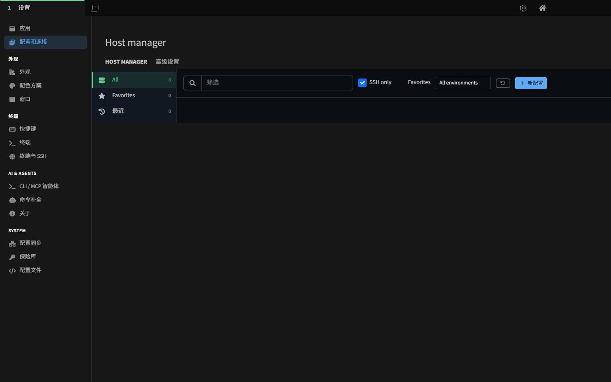
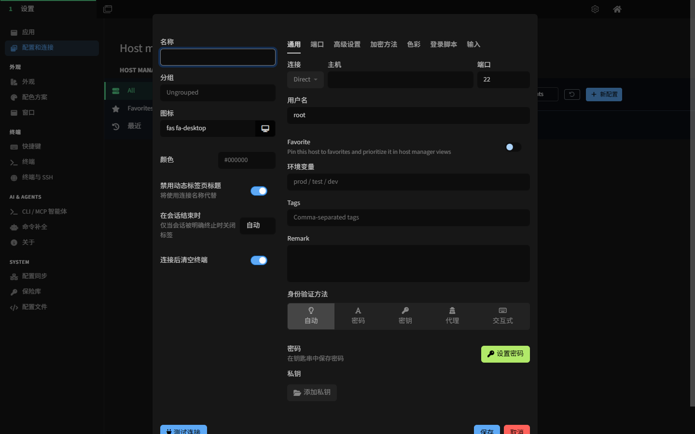
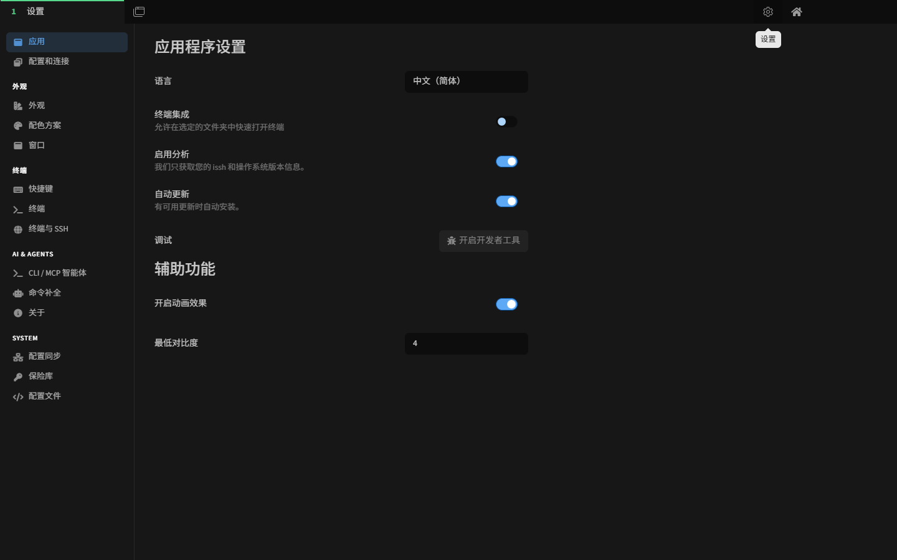
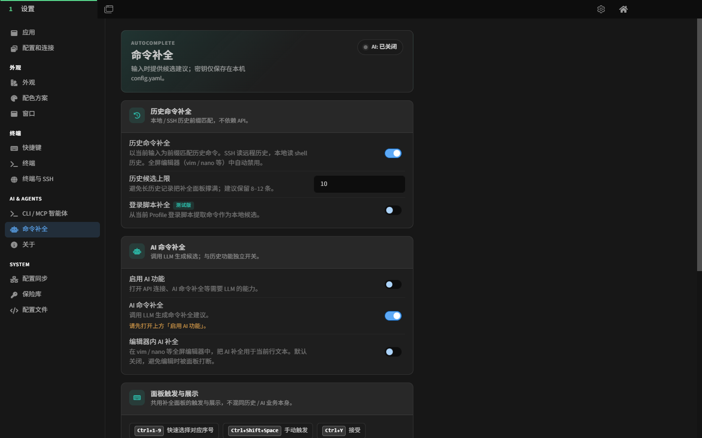
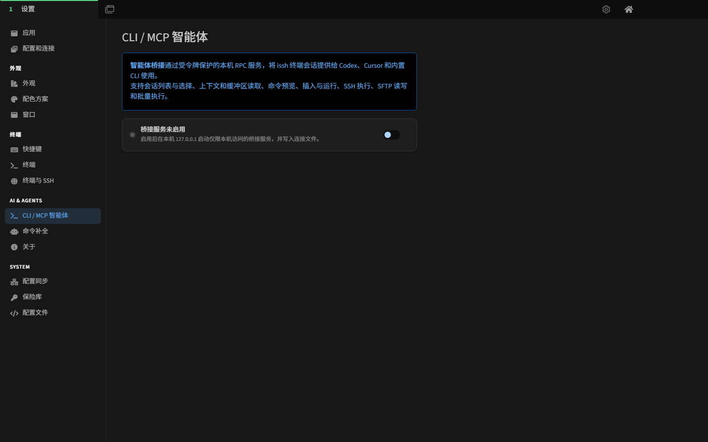
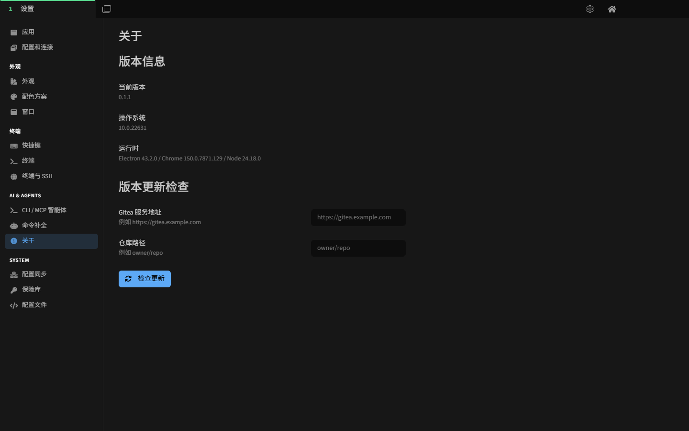

# iSSH 使用手册

**适用版本：0.1.1（Windows x64）**  
**手册日期：2026 年 8 月**

> iSSH 是基于 Tabby 的 Windows SSH 与本地终端客户端。本版本在终端、SSH、Profile 管理、SFTP、配置同步和保险库能力之外，增加了命令补全、下一条命令预测，以及供 Codex、Cursor、Claude Desktop 等外部智能体使用的本地 CLI / MCP Agent Bridge。

---

## 1. 开始之前

### 1.1 适合哪些用户

- 只需要 PowerShell、CMD、Git Bash、WSL 等本地 Shell 的用户；
- 需要保存和分类多台 SSH 主机的运维、开发和测试人员；
- 需要使用密码、私钥、SSH Agent、跳板机、代理、端口转发或 SFTP 的用户；
- 希望通过历史记录或兼容 OpenAI 的模型获得命令补全的用户；
- 希望让本机 AI Agent 在明确授权范围内读取或操作 iSSH 会话的用户。

不启用 AI 功能和 Agent Bridge 时，iSSH 仍是完整的本地终端和 SSH 客户端。

### 1.2 推荐阅读顺序

1. 第 2～5 章：安装、主界面、本地终端和 SSH 连接。
2. 第 6～9 章：主机管理、终端、文件传输和常用设置。
3. 第 10 章：历史命令与 AI 命令补全。
4. 第 11 章：CLI / MCP Agent Bridge。
5. 第 13～15 章：安全、故障排查和快速检查清单。

### 1.3 界面与术语

- **Profile（配置）**：一条可复用的本地 Shell 或 SSH 连接配置。
- **标签页**：窗口顶部或侧边的会话容器。
- **分屏**：同一标签页中的多个终端窗格。
- **Bridge**：iSSH 在 `127.0.0.1` 上启动的本机 Agent Bridge。
- **候选**：命令补全面板显示的历史、登录脚本或 AI 建议。

## 2. 安装、升级与首次启动

### 2.1 安装

1. 关闭正在运行的旧版 iSSH。
2. 双击 `issh-0.1.1-setup-x64.exe`。
3. 按安装向导完成安装。
4. 从开始菜单或桌面快捷方式启动 iSSH。

安装版会把程序安装到当前用户目录。升级通常保留配置，但在重要环境中仍建议先备份配置文件和 SSH Profile。

### 2.2 便携模式

在 `issh.exe` 同目录创建 `data` 文件夹后，iSSH 会将用户数据放在该目录中。便携模式适合测试、隔离配置或随移动介质使用；不要把含密码、密钥或连接令牌的 `data` 目录交给他人。

### 2.3 首次启动向导

首次启动可设置：

- 界面语言；
- 跟随系统、亮色或暗色主题；
- 是否启用匿名安装统计；
- 是否启用全局显示/隐藏快捷键。

这些选项之后均可在设置中调整。

### 2.4 主界面

左侧分类：

- **全部**：全部已保存主机；
- **收藏**：收藏的常用主机；
- **最近**：最近连接的 Profile；
- **内置**：PowerShell、CMD、Git Bash 等本地 Shell。

主区域显示当前分类中的主机卡片。右上角齿轮进入设置，主页按钮返回主机管理器。界面底部显示当前版本。

## 3. 本地终端

### 3.1 打开本地 Shell

1. 返回主机管理器。
2. 展开“内置”。
3. 双击 PowerShell、CMD、Git Bash 或系统默认 Shell。

Windows 默认可用 `Ctrl+Shift+T` 新建本地终端。具体 Shell 列表取决于本机已安装的软件。

### 3.2 新建自定义本地 Profile

1. 打开“设置 → 配置和连接”。
2. 点击“新配置”。
3. 选择已有本地模板，或复制现有 Profile。
4. 设置名称、可执行文件、参数、启动目录、环境变量和图标。
5. 点击“保存”。

### 3.3 常见本地 Shell

- Windows PowerShell 与 PowerShell Core；
- CMD（stock 或 Clink）；
- Git Bash；
- WSL；
- Cygwin、MSYS2、Cmder 等兼容 Shell。

如果某个 Shell 没有自动出现，检查其可执行文件是否存在，并手动新建 Profile。

## 4. 新建 SSH 连接

### 4.1 打开配置页

1. 打开“设置 → 配置和连接”。
2. 点击“新配置”。
3. 选择“SSH 连接”。

### 4.2 基本信息

| 字段 | 用途 | 示例或建议 |
|---|---|---|
| 名称 | 标签页和主机管理器中的名称 | `生产-Web-01` |
| 分组 | 将主机放入分组或子分组 | `生产/华东` |
| 图标、颜色 | 快速区分连接用途 | 生产环境使用醒目颜色 |
| 主机 | 域名或 IP 地址 | `server.example.com` |
| 端口 | SSH 服务端口 | 默认 `22` |
| 用户名 | 远程登录账号 | `ops` |
| Favorite | 固定到收藏并提高排序 | 常用主机开启 |
| 环境 | 用于筛选环境 | `prod`、`test`、`dev` |
| Tags | 多维分类 | `web,nginx` |
| Remark | 用途、负责人或注意事项 | 不要填写密码或令牌 |

点击“测试连接”可在保存前检查地址和认证配置。

### 4.3 身份验证

- **自动**：按可用方式自动尝试；
- **密码**：使用账号密码，可选择保存到钥匙串；
- **密钥**：添加一个或多个私钥，支持带口令的 RSA-SHA2 / ECDSA 密钥；
- **代理/Agent**：使用 Pageant 或 Windows OpenSSH Agent；
- **交互式**：用于验证码、多因素认证或服务端交互提问。

优先使用私钥或系统 SSH Agent。不要把密码直接写进登录脚本、备注、环境变量或普通文件。

### 4.4 首次连接与主机密钥

第一次连接时，iSSH 会显示服务器公钥指纹。先通过可信渠道核对，再接受并保存。

已保存主机的指纹突然变化时，先确认服务器是否重装、负载均衡目标是否变化或 DNS 是否异常；未确认前不要继续连接。

### 4.5 连接方式、跳板机与代理

“连接”区域支持：

- **Direct**：直接连接；
- **Proxy Command**：通过自定义代理命令；
- **跳板机**：经另一个已保存 SSH Profile 转发；
- **SOCKS 代理**：通过 SOCKS4/5 代理；
- **HTTP 代理**：经 HTTP CONNECT 代理。

使用跳板机前，先单独保存并测试跳板机 Profile。代理地址、认证信息和网络路径错误都会造成连接超时。

### 4.6 高级连接选项

根据服务器能力和安全策略，可配置：

- 加密算法、密钥交换算法和主机密钥算法；
- 连接保活与重连；
- SSH Agent 转发；
- X11 转发；
- 本地、远程和动态 SOCKS 端口转发；
- 终端类型、字符编码和远程环境变量；
- 登录脚本，以及连接后是否清空终端。

不要随意降低加密算法安全等级。旧服务器确实需要兼容算法时，应仅对对应 Profile 单独配置。

## 5. 连接、断开与会话生命周期

### 5.1 发起连接

- 在主机管理器双击主机卡片；
- 选中 Profile 后点击连接；
- 使用 Profile 选择器搜索并打开；
- 从“最近”重新打开使用过的主机。

### 5.2 会话结束行为

Profile 可设置 Shell 退出后：

- 自动处理；
- 保留标签；
- 自动重新连接；
- 关闭标签。

生产环境建议保留断开后的输出，便于排查；不稳定网络可按需启用重连。

### 5.3 连接异常时先看什么

观察终端中的报错类型：超时通常与网络/代理有关；认证失败通常与用户名、密码、私钥或 Agent 有关；主机密钥错误则需要核对指纹。

## 6. 主机管理器

主机管理器支持：

- 按名称、主机地址和备注搜索；
- 仅显示 SSH Profile；
- 按收藏、环境、标签和最近使用筛选；
- 创建分组和子分组；
- 批量修改收藏、分组、环境与标签；
- 复制、隐藏或删除 Profile；
- 为主机设置颜色和图标。

推荐将生产、测试、开发分成不同环境，并对数据库、Web、存储、网络等使用标签。删除 Profile 前先确认它未被跳板机或自动化配置引用。

## 7. 终端日常操作

### 7.1 默认快捷键

| 操作 | Windows 默认快捷键 |
|---|---|
| 新建本地终端 | `Ctrl+Shift+T` |
| 打开设置 | `Ctrl+,` |
| 复制 / 粘贴 | `Ctrl+Shift+C` / `Ctrl+Shift+V` |
| 搜索终端内容 | `Ctrl+Shift+F` |
| 关闭标签页 | `Ctrl+Shift+W` |
| 下一个 / 上一个标签页 | `Ctrl+Tab` / `Ctrl+Shift+Tab` |
| 向右 / 向下分屏 | `Ctrl+Shift+S` / `Ctrl+Shift+D` |
| 最大化当前分屏 | `Ctrl+Alt+Enter` |
| Profile 选择器 | `Ctrl+Shift+E` |
| 命令选择器 | `Ctrl+Shift+P` |

所有快捷键均可在“设置 → 快捷键”中搜索和修改。快捷键冲突时，以设置页显示的当前绑定为准。

### 7.2 标签页与分屏

- 一个标签页可以包含多个窗格；
- 分屏可同时运行日志、监控和交互命令；
- 可调整窗格大小、交换位置或最大化当前窗格；
- 关闭最后一个窗格会结束该标签页。

### 7.3 复制、粘贴与搜索

- 终端可配置“选择即复制”和右键行为；
- 多行粘贴会按设置显示风险提示；
- Bracketed Paste 可让兼容程序识别粘贴内容；
- 搜索只查当前终端回滚缓冲区。

粘贴来自网页、聊天或工单的命令前，先检查换行、管道和重定向。

### 7.4 批量输入

批量输入会把同一输入发送到多个选定会话。使用前确认：

1. 所有目标主机均正确；
2. 当前目录和用户身份一致；
3. 命令可重复执行；
4. 不包含需要逐台确认的破坏性操作。

### 7.5 终端工具栏与通知

终端工具栏提供常用操作入口。iSSH 还能检测前台进程状态，并在长任务完成时显示通知；相关行为可在应用、终端或窗口设置中调整。

## 8. SFTP 与文件传输

### 8.1 SFTP 面板

在已连接 SSH 会话中打开 SFTP 面板，可以：

- 浏览目录和返回上级；
- 上传、下载文件；
- 新建目录；
- 重命名和删除远程文件；
- 刷新目录状态。

### 8.2 Zmodem

服务器安装并启用 Zmodem 工具时，可在终端通过 `rz` / `sz` 触发文件收发。是否可用取决于远端环境和终端设置。

### 8.3 常见问题

- “SFTP 会话已断开”：先重连 SSH，再打开面板；
- 无法进入目录：检查远程账号权限；
- 上传失败：检查磁盘空间、文件名权限和网络；
- Agent Bridge 的 SFTP 受额外根目录和单次写入上限约束，和人工 SFTP 面板不是同一权限边界。

## 9. 设置页面完整说明

### 9.1 应用

设置语言、终端集成、匿名分析、自动更新、开发者工具和动画/对比度等辅助功能。

### 9.2 配置和连接

创建、编辑、复制、筛选和分组本地及 SSH Profile；“高级设置”用于更细的 Profile 管理选项。

### 9.3 外观、配色方案与窗口

- **外观**：主题、字体、标签页位置和视觉布局；
- **配色方案**：终端前景色、背景色和 ANSI 色表；
- **窗口**：窗口行为、透明/模糊效果、Quake 模式和 GPU 加速兼容开关。

### 9.4 终端

设置光标、回滚行数、复制粘贴、右键、搜索、响铃、终端行为和渲染相关选项。

### 9.5 快捷键

按操作名称搜索当前绑定，点击后重新录入组合键。修改前检查是否与系统、输入法或其他应用冲突。

### 9.6 终端与 SSH

包含 Windows ConPTY、本地 Shell 兼容项、主机密钥验证、SSH Agent、连接行为等终端与 SSH 全局设置。

### 9.7 配置同步

用于在设备间同步应用配置。启用前确认后端、加密和冲突策略；首次同步前先备份本地配置，避免错误方向覆盖。

### 9.8 保险库

保险库用于保护敏感配置。设置主密码后应妥善保管；查看保险库内容需要重新验证主密码。忘记主密码可能导致受保护内容无法恢复。

### 9.9 配置文件

高级用户可查看或编辑底层配置。手动修改前备份文件，注意 YAML 缩进，并在保存后重启应用验证。

### 9.10 AI & AGENTS

- **CLI / MCP 智能体**：本机桥接、权限、令牌和审计；
- **命令补全**：历史、登录脚本和 AI 补全；
- **关于**：版本、运行时和 Gitea 更新检查。

## 10. 命令补全

### 10.1 候选来源

| 来源 | 默认状态 | 说明 |
|---|---|---|
| 历史命令 | 开 | 本地/SSH 历史前缀匹配，不需要 API |
| 登录脚本 | 关 | 从当前 Profile 登录脚本提取，测试版 |
| AI live 补全 | AI 总开关关 | 输入后调用模型生成候选 |
| AI 下一条预测 | AI 总开关关 | 提交命令后在后台预取后续命令 |

所有来源进入同一过滤、排序、去重和命令归一化路径。来源不同但命令相同的候选不会重复显示。

### 10.2 首条命令与触发规则

- 每个 Shell 会话的第一条命令不主动请求 AI live 补全，只显示历史和登录脚本；
- 提交第一条命令后，开始预取下一条命令；
- 默认输入达到 2 个字符即可触发，不要求先出现空格；
- 本地候选立即出现，live AI 默认等待 600 ms 防抖；
- AI 连续 3000 ms 无响应时静默回退到本地或缓存候选；
- vim、nano 等 alternate screen 中的 AI 文本补全默认关闭；
- 检测到敏感输入或 Agent 终端时会停止补全。

### 10.3 历史与登录脚本补全

本地终端读取 Bash、Zsh、Fish 或 PowerShell 历史；SSH 会话读取远端历史并使用缓存，避免每次按键都访问远程。历史候选默认最多 10 条。

登录脚本补全只把 Profile 登录脚本中的合法命令作为候选。所有候选仍会经过命令归一化和安全过滤。

### 10.4 配置 AI 补全

1. 打开“设置 → 命令补全”。
2. 开启“启用 AI 功能”和“AI 命令补全”。
3. 填写 API Base URL、API Key 和主模型。
4. 可填写补全专用模型；留空时使用主模型。
5. 保持“补全时关闭思考”可减少推理模型延迟。
6. 点击“测试连接”，确认真实补全请求可被服务端解析。

接口需兼容 OpenAI Chat Completions 风格。常见本机端点包括 Ollama `http://localhost:11434/v1` 和 LM Studio `http://localhost:1234/v1`；模型名必须与服务端一致。

### 10.5 面板和交互设置

- **输入时自动补全**：关闭后仅手动触发；
- **无空格也可触发**：首个命令词达到长度即触发；
- **最小触发长度**：默认 2；
- **轻提示模式**：能自然续写时显示 ghost text，否则显示列表；
- **水平/垂直偏移**：默认 32 / 52 像素；
- **不透明度**：数值越低越通透，100% 关闭毛玻璃；
- **确认时执行**：默认关闭；开启后接受候选会立即回车，需谨慎。

### 10.6 隐私

“发送终端上下文到 API”开启时，最近输出会先脱敏再发送；关闭后只发送当前命令片段，不附带最近输出。处理客户数据、生产密钥或个人信息时建议关闭。

API Key 仅保存在本机 `config.yaml`。不要在截图、日志、工单或聊天中暴露它。

### 10.7 快捷键

| 操作 | 默认快捷键 |
|---|---|
| 手动触发 | `Ctrl+Shift+Space` |
| 接受当前候选 | `Ctrl+Y` |
| 下一条 / 上一条 | `Ctrl+N` / `Ctrl+U` |
| 直接选择第 1～9 条 | `Ctrl+1` ～ `Ctrl+9` |
| 关闭面板 | `Esc` |

## 11. CLI / MCP Agent Bridge

### 11.1 作用与边界

Agent Bridge 将 iSSH 会话通过受令牌保护的本机 RPC 服务提供给外部 AI Agent。默认只监听 `127.0.0.1`，不开启时不会启动服务。

它与命令补全相互独立：Bridge 不参与候选排序，命令补全也不会扩大 Agent 权限。

### 11.2 启用步骤

1. 打开“设置 → CLI / MCP 智能体”。
2. 开启桥接服务。
3. 保留自动端口，或按需指定未占用端口。
4. 选择最小令牌权限范围。
5. 保持审计日志开启。
6. 设置 SFTP 根目录和单次最大写入量。
7. 点击连接测试，确认页面显示运行中。

iSSH 必须保持运行。安装包已包含 `issh-agent` CLI 和 stdio MCP server，不需要额外安装技能包；脚本不会自动注册为全局命令。

### 11.3 权限范围

| 权限 | 典型能力 | 建议 |
|---|---|---|
| 读取 | 状态、会话/Profile 列表、上下文、缓冲区、命令预检 | 默认仅查看时开启 |
| 写入 | 连接、断开、选择会话 | Agent 需管理会话时开启 |
| 执行 | 插入、运行、等待结果、SSH 执行、批量执行 | 仅任务期间开启 |
| SFTP | 列出、读取、写入远程文件 | 限制根目录后按需开启 |

### 11.4 可用能力

- Bridge 状态和版本；
- 会话及 SSH Profile 列表、选择、连接和断开；
- 当前工作目录、Shell、操作系统、最近输出和终端缓冲区；
- 命令预检、插入、运行、等待输出与退出码；
- 独立 SSH 执行和多会话批量执行；
- SFTP 列表、读取和写入；
- 审计日志查看。

危险命令和多会话批量执行仍会进入 iSSH 本机确认流程，MCP 不能绕过。

### 11.5 连接文件、令牌与发现文件

桥接启动后写入连接文件，其中包含地址、令牌和能力信息。它等同敏感凭据：

- 不要提交到 Git 或发到聊天；
- 泄露后立即轮换令牌；
- “智能体可读发现文件”默认关闭，仅在调用方沙箱无法读取主文件时开启；
- 定期查看审计日志，确认调用方、工具、目标和结果符合预期。

### 11.6 Codex、Cursor 与 Claude Desktop

设置页会生成或复制对应产品的配置：

- Codex CLI 配置；
- Cursor MCP 配置；
- Claude Desktop MCP 配置；
- 智能体规则；
- stdio MCP server 路径和连接文件环境变量。

在支持自定义 stdio MCP 的客户端中，启动命令通常为 `node`，参数为设置页显示的 `issh-mcp-server.mjs` 完整路径，环境变量为 `ISSH_AGENT_BRIDGE_FILE=<连接文件路径>`。不同客户端格式不同，应直接使用设置页为该客户端生成的内容。

iSSH 提供 stdio 和旧式 SSE；若客户端要求 Streamable HTTP `/mcp`，应使用 stdio 配置，不能把 SSE 地址当成 Streamable HTTP。

### 11.7 独立 CLI

安装包中的 `issh-agent` 可用于脚本或人工诊断，能力与 MCP 核心工具一致。使用设置页给出的连接文件，不要把令牌硬编码进脚本。批处理前先用只读的状态、列表和预检命令确认目标。

## 12. 关于与更新检查

“设置 → 关于”显示：

- iSSH 当前版本；
- Windows 版本；
- Electron、Chrome 和 Node 运行时；
- Gitea 更新检查配置。

填写 Gitea 服务地址和 `owner/repo` 仓库路径后点击“检查更新”。发现新版本时前往对应发布页下载。更新前阅读发行说明，并备份重要配置。

## 13. 安全使用建议

1. 保持主机密钥验证开启，首次连接核对指纹。
2. 优先使用私钥或 SSH Agent，不在 Profile 备注和登录脚本保存密码。
3. 生产主机使用独立分组、环境、标签和明显颜色。
4. 多行粘贴、批量输入和补全自动执行保持谨慎。
5. AI 上下文只在数据策略允许时发送。
6. Agent Bridge 使用最小权限，执行和 SFTP 权限用完即关。
7. 保持审计日志开启，连接文件泄露后轮换令牌。
8. 给 Agent SFTP 配置根目录和写入大小上限。
9. 只加载可信本地插件，定期备份配置和保险库。

### 13.1 Electron / Chromium 加固说明

iSSH 0.1.1 使用 Electron `43.2.0`、Chrome `150.0.7871.129` 和 Node `24.18.0`。当前构建采用：

- 本地页面 CSP，限制脚本、对象、页面嵌入和网络连接；
- 特权 IPC 发送者校验；
- ASAR 完整性验证与 `onlyLoadAppFromAsar`；
- 禁用 `runAsNode`、`NODE_OPTIONS` 和 CLI 调试参数 Fuse；
- 可选的“设置 → 窗口 → Hacks → Disable GPU acceleration”。

这些是补偿性控制，不能等同于已移除所有 Chromium CVE。当前架构仍有 `nodeIntegration: true` 与 `contextIsolation: false` 的剩余风险。仅加载可信内容，并在官方稳定 Electron 提供适合的修复后执行完整升级与回归验证。详细记录见 `SECURITY_REMEDIATION_2026-08-02.md`。

## 14. 故障排查

### 14.1 SSH 无法连接

依次检查主机和端口、网络/防火墙、用户名、认证方式、私钥口令、Agent、代理/跳板机、算法兼容性和主机密钥。使用“测试连接”缩小问题范围。

### 14.2 终端乱码或显示异常

检查远端 locale、终端编码、字体是否含目标字形、终端类型和 GPU 渲染。必要时更换字体或临时关闭 GPU 加速后重启。

### 14.3 命令补全不显示

检查：候选来源是否开启、输入是否达到最小长度、历史是否有匹配、AI 总开关和 API 配置、连接测试、当前是否为会话首条命令、是否在 vim/nano 或 Agent 终端、是否出现密码提示。

### 14.4 AI 只有历史候选

确认 API 端点支持 Chat Completions、模型名存在、响应格式可解析、请求未超过 3000 ms 无响应超时，并查看服务端日志。下一条预取只会在输入与缓存候选匹配时显示。

### 14.5 Bridge 未运行

确认开关已启用、端口未占用、iSSH 保持运行、连接文件目录可写，并重新打开设置页触发状态刷新。

### 14.6 Agent 能读但不能执行

读取、写入、执行和 SFTP 是独立权限。连接/断开/选择会话需要写入；运行命令需要执行；文件操作需要 SFTP。

### 14.7 MCP 客户端看不到工具

确认使用 stdio、启动命令为 Node、脚本路径完整、`ISSH_AGENT_BRIDGE_FILE` 指向当前连接文件。保存配置后新建客户端任务或重启客户端。

### 14.8 危险命令停在等待状态

这是预期保护。回到 iSSH 查看本机确认框；只有用户明确批准后才会继续。

### 14.9 SFTP 路径不可访问

检查 SSH 连接、远端文件权限、Bridge SFTP 根目录以及单次写入大小。人工 SFTP 面板与 Agent SFTP 的限制需分别检查。

### 14.10 配置修改后异常

恢复最近备份，检查 YAML 缩进和字段类型，再完全退出并重启 iSSH。不要直接删除保险库或连接文件来“修复”配置。

## 15. 快速检查清单

### 15.1 普通 SSH 用户

1. 新建 SSH Profile。
2. 填写地址、端口、用户名和认证方式。
3. 测试连接并核对主机指纹。
4. 保存、分组、标记环境和标签。
5. 需要文件管理时打开 SFTP。

### 15.2 命令补全用户

1. 保持历史补全开启。
2. 如需 AI，配置端点、密钥和模型并测试。
3. 确认上下文发送策略。
4. 输入至少 2 个字符。
5. 用 `Ctrl+Y` 接受，用 `Ctrl+1～9` 直接选取。

### 15.3 Agent Bridge 用户

1. 开启 Bridge，确认显示运行中。
2. 只授予任务所需权限。
3. 限制 SFTP 根目录和写入大小。
4. 使用设置页生成的客户端配置。
5. 先列出会话和预检，再执行命令。
6. 完成任务后检查审计日志并收回高权限。

---

**手册维护说明**  
本手册和全部 iSSH 截图均基于 0.1.1 当前构建重新整理。版本、设置名称、默认值、快捷键、运行时或 MCP 接入方式变化时，应同步更新 Markdown、DOCX、README 与截图资产。
